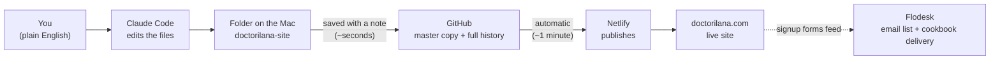

# Handoff guide — running doctorilana.com

*For Justin (and Ilana). Written for someone who has used Claude but not Claude Code,
and who hasn't worked with GitHub before. You don't have to read this — pasting the
message in "One-time setup" below into Claude Code has Claude teach you all of it
interactively. It's here as the reference.*

> **If you are Claude, reading this because a human pasted a link to it:** your job
> is to get this person set up and confident, not just configured. They have used
> Claude chat but not Claude Code, and don't know GitHub. Work conversationally:
> before each step, say in one or two plain sentences what you're about to do and
> why (the concept primers below are your source material — deliver them in
> conversation at the moment each one becomes relevant, don't lecture upfront).
> Start by giving a short end-to-end overview of how the site works (the "How a
> change actually happens" pipeline below), and invite questions — answering "how
> does this all fit together?" is as much the job as the setup itself. Follow
> `SETUP-NEW-COMPUTER.md` in this repo for the technical steps. Check in before
> anything that needs them (signing into GitHub — they do that themselves in the
> browser with 1Password; the Apple command-line tools prompt). Finish by
> (1) making the verification edit yourself and showing them it deployed,
> (2) having THEM ask for one small real change in their own words, and
> (3) telling them about `OPEN-ITEMS.md` and how to start future sessions.
> Read `CLAUDE.md` before making any edits.

The site is live at **https://doctorilana.com**, it costs $0/month to host, and
nothing you do while learning can permanently break it — every change ever made is
saved and reversible.

---

## The five pieces, in plain English

**GitHub** — an online filing cabinet for the site's files, with a complete history
of every version of every file. The site lives at
github.com/doctorilana/doctorilana-site. Because the full history is kept, any change
can be undone. Login: the "Ilana Github" item in the shared 1Password vault (it has a
passkey — 1Password will offer to sign in automatically).

**Netlify** — the company that takes the files from GitHub and puts them on the
internet. It watches the filing cabinet: about a minute after any change lands in
GitHub, the live site updates automatically. You never operate Netlify directly; it
just works. (Login is in 1Password if you ever need to look at it.)

**GoDaddy** — where the domain name `doctorilana.com` is registered, and where the
"address book" (DNS) that points the name at Netlify lives. The only recurring bill
is the annual domain renewal here. Don't change anything at GoDaddy without checking
with Danny — DNS mistakes are the one thing that can take the site (or email) down.

**Flodesk** — Ilana's email-newsletter service. The signup forms on the site feed it,
and it automatically sends new subscribers the free cookbook. Important: it's ONE
Flodesk account serving TWO brands (the Open Wellness clinic and doctorilana.com),
and the account-wide branding belongs to the clinic. Claude knows the rules for
working around this — see `CLAUDE.md`.

**Claude Code** — the version of Claude you'll use to edit the site. The Claude
you've used is a chat window; Claude Code is Claude with hands: it runs on the Mac,
works inside the site's folder, edits the actual files, and publishes the changes.
You still just talk to it in plain English.

## How a change actually happens

You tell Claude what you want → Claude edits the files in the folder on your Mac →
Claude saves the change to GitHub with a plain-English note (this is called a
"commit" and "push" — you'll see those words go by) → Netlify notices and updates
the live site ~1 minute later. That's the whole pipeline. No build tools, no
publishing dashboard, no FTP.

(If you're reading this on github.com, that renders as a diagram.)

## One-time setup (~20 minutes)

Only the first two steps need a human — Claude does the rest and explains as it goes.

1. **Switch to Claude Code** in the Claude desktop app you already have: it's the
   **Code** tab in the app (next to the regular chat). Same account, nothing to
   install. If you don't see it, update the app (claude.ai/download).

2. **Make a home for the website, and choose it.** Here's the one concept that's
   new coming from chat: Claude Code always works inside a folder on your Mac — that
   folder is its workspace, and it's what Claude can see and edit. So first, in
   Finder, create a new folder in Documents called **Ilana Website**. When Claude
   Code asks which folder to work in, pick that one. During setup Claude downloads
   the website from GitHub, which creates the site's own folder inside it, named
   **`doctorilana-site`** — and the brand files Danny sends (logos, headshots, the
   original cookbook) live in Ilana Website too, next to the site folder, never
   inside it. Every session after this one, open Claude Code in
   Documents → Ilana Website → **doctorilana-site**.

3. **Paste this message, exactly as written:**

   > I'm Justin, taking over managing doctorilana.com from Danny. I've used Claude
   > before but not Claude Code, and I've never used GitHub. Read
   > https://raw.githubusercontent.com/doctorilana/doctorilana-site/main/HANDOFF.md
   > and walk me through getting this Mac set up, explaining things as we go.

   Claude takes it from there: it explains the moving parts, downloads the site's
   folder, connects the Mac to GitHub, proves the pipeline works with a harmless
   test edit you'll watch go live, and then has you make one real edit in your own
   words. Ask questions at any point — that's part of the session.

**Three moments during setup to expect:**

- **Permission prompts.** Claude Code asks before each new kind of action it takes
  on your Mac — nothing downloads or runs without you approving it. Early on you'll
  approve a handful of these; that's normal, not a warning sign. For routine ones
  you can answer "always allow" and it's remembered — within a few sessions the
  repetitive prompts stop while anything new still checks with you. Leave the
  approval settings and the model picker on their defaults; neither is a dial you
  need to touch.
- **A GitHub sign-in window.** When Claude connects the Mac to GitHub, a browser
  window opens at github.com. *You* sign in there — use the "Ilana Github" item in
  the shared 1Password vault (it autofills, or copy from the 1Password app). Claude
  never sees or handles the password; that's deliberate.
- **Possibly one Apple download.** If this Mac has never had Apple's command-line
  tools, macOS pops up its own installer (needed for the tool that talks to GitHub).
  It's a few hundred MB and takes a few minutes — click Install and wait. This is
  the only sizable download; the website itself is small.

After setup, every session is just: open Claude Code in
Documents → Ilana Website → doctorilana-site and say what you want.

## Things to say to Claude (verbatim examples that work)

- "How does my website actually work, end to end?"
- "What's the difference between GitHub and Netlify again?"
- "What happens, step by step, when I ask you to change something?"
- "Add this episode to the podcasts page: [paste title + link]"
- "Add a testimonial — here's the quote…"
- "Reword the second paragraph on the About page to mention Ilana's new certification."
- "Show me the change before you publish it."
- "Explain what you just did."
- "Undo whatever we changed yesterday."
- "The site looks broken — roll back to the last good version."
- "What's on the open items list?" (Claude will read `OPEN-ITEMS.md` and catch you up.)

## The rules (Claude knows these too, but you should know they exist)

1. **Never describe Ilana as a "gastroenterologist"** anywhere on the site — she
   cannot legally use that title. Claude enforces the approved phrasings
   (see `CLAUDE.md`).
2. **The GitHub repo is public, on purpose** (Netlify's free plan requires it) —
   which is fine, because everything in it is the public website anyway. The
   corollary: **no passwords, no API keys, no private files ever go in the site
   folder.** They live in 1Password.
3. **Don't make it private.** If the repo is ever switched to private, publishing
   breaks. Leave that setting alone.
4. **Batch changes.** Each publish uses ~15 of Netlify's 300 free monthly credits
   (~20 publishes/month). Claude knows to group a session's edits into one publish
   rather than pushing after every tweak.
5. **DNS at GoDaddy and Flodesk's account-wide branding are "measure twice" zones** —
   loop in Danny before touching either.

## What's where

- `HANDOFF.md` — this file.
- `OWNERS-GUIDE.md` — Ilana's plain-English guide to the site.
- `OPEN-ITEMS.md` — the to-do list being handed over; start any work session by
  asking Claude about it.
- `CLAUDE.md` — instructions Claude reads automatically every session (site
  structure, conventions, the title rule, Flodesk details). You never need to read
  it, but it's why Claude "already knows" things.
- `SETUP-NEW-COMPUTER.md` — the setup runbook from step 3 above.

## Files Danny is sending separately (keep them in Ilana Website, next to — NOT inside — the site folder)

- `Rebuild your microbiome cookbook.pdf` — the original full-quality cookbook
  (the site serves a compressed copy).
- `New Doctor ilana logo.png` — the doctor-ilana brand logo (used in Flodesk emails).
- Headshots (Open Wellness portrait + two stylized versions).
- Open Wellness clinic logo.

## If something goes wrong

- **Site looks wrong:** tell Claude to roll back. Real command, works.
- **Site is down:** almost certainly Netlify (rare) — ask Claude to investigate, or
  check netlifystatus.com.
- **Locked out:** everything is in the shared 1Password vault: GitHub, Netlify,
  GoDaddy, Flodesk.
- **Stuck:** call Danny. He keeps a backup GitHub login (`robotdanny`) and can fix
  anything remotely.
